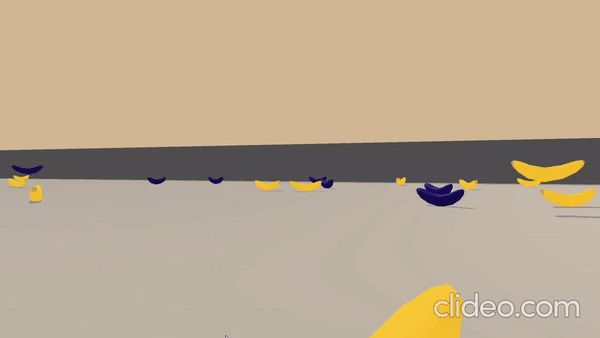

[//]: # (Image References)

[image1]: https://user-images.githubusercontent.com/10624937/42135619-d90f2f28-7d12-11e8-8823-82b970a54d7e.gif "Trained Agent"

# Project 1: Navigation

### Introduction

For this project, you will train an agent to navigate (and collect bananas!) in a large, square world.  

![Trained Agent][image1]

A reward of +1 is provided for collecting a yellow banana, and a reward of -1 is provided for collecting a blue banana.  Thus, the goal of your agent is to collect as many yellow bananas as possible while avoiding blue bananas.  

The state space has 37 dimensions and contains the agent's velocity, along with ray-based perception of objects around agent's forward direction.  Given this information, the agent has to learn how to best select actions.  Four discrete actions are available, corresponding to:
- **`0`** - move forward.
- **`1`** - move backward.
- **`2`** - turn left.
- **`3`** - turn right.

The task is episodic, and in order to solve the environment, your agent must get an average score of +13 over 100 consecutive episodes.

We will use Deep Q Learning to solve the environment . 

Let's first see an agent play the game , by executing action at random 

As you can see that the agent doesn't no any good and we didn't expect it to . 

Here's the agent playing after being trained . 

You can see that the AI has learnt to avoid the **Blue Banana** while collecting the **Yellow** ones . 

## Installation :- 
###### Clone this repository using `git clone https://github.com/Pratik1234agarwal/Deep-Reinforcement-Implementations.git`
If u want to run this locally on your computer , follow the steps given below :- 

### Installing packages :- 
#### 1. Using Conda 
I have included the **.yml** file for the conda env 
To install simply open a command prompt and navigate to the setup folder and type the following:- 
    conda env create -f navigation.yml
This will download and install all the required packages 

#### 2. Using PiP
There's a `requirement.txt` file inside the setup folder 
To install just navigate to the setup folder in the command prompt and enter the following :-
    pip install -r requirement.txt

This installs the packages for you . 

Proceed below to download the Unity environment 
    

### Download the Unity Environment

1. Download the environment from one of the links below.  You need only select the environment that matches your operating system:
    - Linux: [click here](https://s3-us-west-1.amazonaws.com/udacity-drlnd/P1/Banana/Banana_Linux.zip)
    - Mac OSX: [click here](https://s3-us-west-1.amazonaws.com/udacity-drlnd/P1/Banana/Banana.app.zip)
    - Windows (32-bit): [click here](https://s3-us-west-1.amazonaws.com/udacity-drlnd/P1/Banana/Banana_Windows_x86.zip)
    - Windows (64-bit): [click here](https://s3-us-west-1.amazonaws.com/udacity-drlnd/P1/Banana/Banana_Windows_x86_64.zip)
    
    (_For Windows users_) Check out [this link](https://support.microsoft.com/en-us/help/827218/how-to-determine-whether-a-computer-is-running-a-32-bit-version-or-64) if you need help with determining if your computer is running a 32-bit version or 64-bit version of the Windows operating system.

    (_For AWS_) If you'd like to train the agent on AWS (and have not [enabled a virtual screen](https://github.com/Unity-Technologies/ml-agents/blob/master/docs/Training-on-Amazon-Web-Service.md)), then please use [this link](https://s3-us-west-1.amazonaws.com/udacity-drlnd/P1/Banana/Banana_Linux_NoVis.zip) to obtain the environment.

2. Place the file inside the repository folder . 
